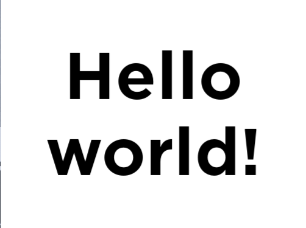
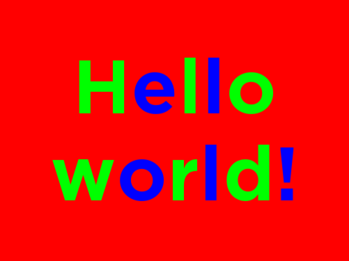
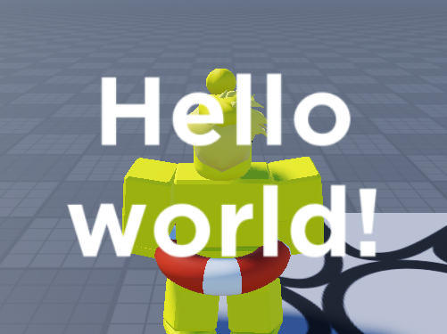
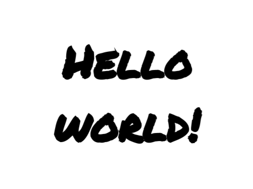
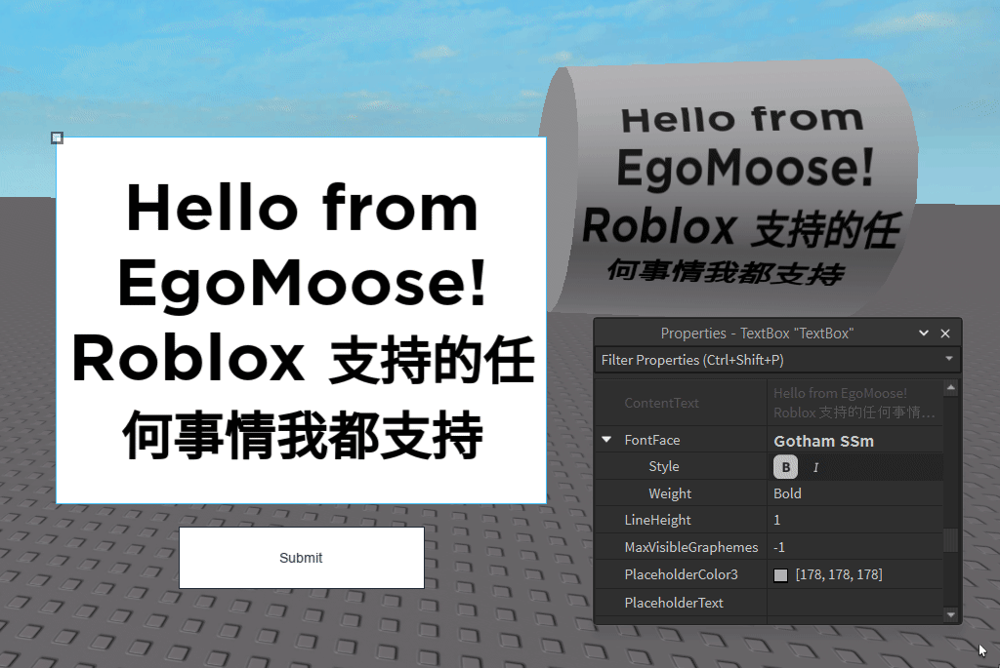

# Text Glyph Bounds Demo
 
This repository is a demo of a very hacky method I created to get accurate glyph bounding boxes entirely in-engine on Roblox. 

I do not condone using this in a live game as it has considerable performance implications and requires a gui to flash on screen momentarily.

Why am I sharing this then? Well in the words of [@boatbomber:](https://x.com/BoatbomberRBLX/status/1762224612132454432)
> I don't care how hacky this is, please open source it. There's so much value here, and open sourcing the methods may help others figure out less hacky methods.

## How does this work?

The quick summary is that we use the [CaptureService](https://create.roblox.com/docs/reference/engine/classes/CaptureService) to convert rendered text into an image. We then throw this image data into an [EditableImage](https://create.roblox.com/docs/reference/engine/classes/EditableImage) where we can look at the pixels to identify each free-floating bounding box in the glyph.


Finally, we take the bounding boxes and merge them together if they're on the same line and overlap horizontally.

## Non Negotiables

Since this is such a hacky method there are quite a few limitations:

CaptureService needs a screen to capture so this cannot be run on the server. 

CaptureService is not instant. In theory, at least one frame is needed to display the text unobscured on screen. From a player perspective, this means something being flashed on screen at run-time which is jarring and looks buggy.

The TextBound size is clamped to the minimum of the two:
1. EditableImage's max size of (1024 x 1024).
2. The player's viewport frame size.

## Implementation details

I want to use this section to highlight a few specific implementation details

#### CaptureService x1.25

**EDIT:**
> As it turns out this section isn't true! The factor that CaptureService scales by is actually dependant on your OS settings. In my case on windows I scale everything up by 125%. This isn't a deal breaker, but something you may need to consider depending who's using this code.

Fun fact: The screenshots taken by CaptureService upscale by a factor of 1.25.

This means that when converting the screenshot into the cropped EditableImage we also have to consider down-scaling. This can blur the image slightly because we're losing a bit of detail due to bilinear interpolation. Luckily, from my testing this has yet to cause any issues.

#### White Text, Transparent background

Say we have the following text frame:



When taking a screenshot we convert our text frame into a specific style. This style has each letter alternate between pure green and pure blue with a background of pure red.



We do this because each of these colors has their own color channel when reading the pixel data of the image.

With this setup we can look at each pixel and if it only has the red channel then we make it transparent. Otherwise we make it white. This leaves us with a text image with white text and a transparent background.



#### Bounding Boxes

You may be wondering why alternate between green and blue? We could get the same result as above by just using one of those channels.

The reason is to help us differentiate between glyphs when calculating bounding boxes. Some fonts are styled such that two glyphs may be touching.



If every glyph was green then there'd be no way to know where the "R" in "WORLD" ends and "L" begins. As such we alternate between green and blue so that if glyphs do touch we have a clear way to identify where they start and end.

## What could this be used for?

As mentioned this isn't really something you'd want to use in a live game. Regardless, here's some situations where I think this could be valuable in its current state:

You could pre-analyze the bounding boxes of certain strings or sets of glyphs and store that information ahead of time. You might even take this a step further and pre-create all your text frames so that each glyph has a bounding box.

The main downside here is that since this isn't a run-time creation you can't change or translate the text which in many cases is a deal breaker. Additionally this would have an increased memory / performance footprint as well since so many more instances need to be rendered.

An actual good use-case would be to create a plugin that can take any text and turn it into an image. We can't pull the trigger on this quite yet as Roblox doesn't currently let you upload editable images, but it seems like it's planned!



## Building the demo

To build the demo simply run:

```
rojo build demo.project.json --output demo.rbxl
```

Then you can enable / disable different demo scripts under the `Demo` folder.
